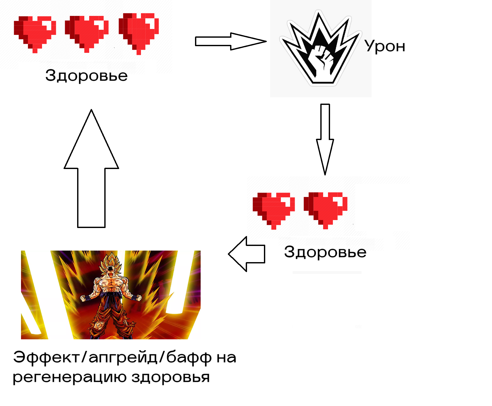

# АНАЛИЗ ДАННЫХ И ИСКУССТВЕННЫЙ ИНТЕЛЛЕКТ [in GameDev]
Отчет по лабораторной работе #1 выполнил(а):
- Опарин Роман Дмитриевич
- РИ230935
Отметка о выполнении заданий (заполняется студентом):

| Задание | Выполнение | Баллы |
| ------ | ------ | ------ |
| Задание 1 | * | 60 |
| Задание 2 | * | 20 |
| Задание 3 | # | 20 |

знак "*" - задание выполнено; знак "#" - задание не выполнено;

Работу проверили:
- к.т.н., доцент Денисов Д.В.
- к.э.н., доцент Панов М.А.
- ст. преп., Фадеев В.О.

[](https://nodesource.com/products/nsolid)

[](https://travis-ci.org/joemccann/dillinger)

Структура отчета

- Данные о работе: название работы, фио, группа, выполненные задания.
- Цель работы.
- Задание 1.
- Код реализации выполнения задания. Визуализация результатов выполнения (если применимо).
- Задание 2.
- Код реализации выполнения задания. Визуализация результатов выполнения (если применимо).
- Задание 3.
- Код реализации выполнения задания. Визуализация результатов выполнения (если применимо).
- Выводы.
- ✨Magic ✨

## Цель работы
Ознакомиться с основными операторами зыка Python на примере реализации линейной регрессии.

## Задание 1
### Выберите одну из игровых переменных в игре СПАСТИ РТФ: Выживание (HP, SP, игровая валюта, здоровье и т.д.), опишите её роль в игре, условия изменения / появления и диапазон допустимых значений. 

Ход работы:
Для описания была выбрана величина "Здоровье" (Health Points(HP)), которая представляет собой шкалу, совмещающую показатель прошедшего урона и статус игрока. Здоровье уменьшается при получении урона и, если оно становится менее 0, игрок считается погибшим, и игра завершается. Оно восстанавливается с помощью способности "Vampyrism" и восстанавливается со временем. Здоровье, как и любая шкала, имеет максимальные и минимальные значения, варьируясь от 0 до 30 на начальном уровне, с возможностью прокачки в процессе игры.
Экономическая модель игры "СПАСТИ РТФ: Выживание" описывается цикличной системой, где заработок, траты и прогресс завязаны на игровой активности.

Ресурсы:
- Монеты: Основная внутриигровая валюта, получаемая за уничтожение зомби.
- Патроны: Расходуемый ресурс для стрельбы из пистолета, покупаемый за монеты.
- Здоровье: Жизнеспособность игрока.

Доход:
- Убийство зомби: Каждый убитый зомби приносит доход игроку.

Траты:
- Оружие и апгрейды:
- Пистолет: Можно улучшать скорострельность и урон.
- Патроны: Ограниченный ресурс, который нужно периодически докупать.
- Здоровье: Возможна покупка способности "vampirism".


Баланс ресурсов:
- Игрок должен зарабатывать монеты быстрее, чем тратить их на базовые ресурсы (патроны и здоровье), чтобы оставались средства на улучшения.
- Чрезмерный дефицит здоровья или патронов убирает мотивацию играть далее и усложняет игровой процесс.
- Для поддержания интереса стоимость улучшений должна увеличиваться экспоненциально, а награды постепенно расти.

Роль здоровья в экономической модели:
- Стимул к тратам: Потеря здоровья вынуждает игрока покупать аптечки или другие способы восстановления, создавая постоянный спрос на монеты.
- Тактический ресурс: Здоровье определяет, сколько ошибок игрок может совершить, прежде чем проиграет, что влияет на его стратегию: агрессивное нападение или экономия ресурсов.
- Стимул прогресса: Улучшения здоровья (например, увеличение максимального HP или регенерация) могут быть важной частью апгрейдов, мотивируя игрока зарабатывать больше монет.





## Задание 2
### С помощью скрипта на языке Python заполните google-таблицу данными, описывающими выбранную игровую переменную в игре “СПАСТИ РТФ:Выживание”.

- Cсылка на гугл таблицу 
https://docs.google.com/spreadsheets/d/13YQN8yLHY7fpjZu7VQ_ddd575LBQKHggo4T-l3-M_O8/edit?gid=0#gid=0
```py
import gspread
import numpy as np

gc = gspread.service_account(filename='unitydatascience-444810-798813615062.json')
sh = gc.open("UnityWorkshop2")

hp = np.random.randint(0, 30, 10)
time_hp = list(range(0, 10))
i = 1 

damage = np.random.randint(1, 15, 10)

while i <= len(time_hp) + 1:
    current_hp = hp[i - 2] - damage[i - 2]
    status = "Живой" if current_hp > 0 else "Мёртвый"
    current_hp = str(current_hp).replace('.', ',')

    # Обновление значений в Google Sheets
    sh.sheet1.update(range_name=f'A{i}', values=[[i]])
    sh.sheet1.update(range_name=f'B{i}', values=[[int(hp[i - 2])]]) # Исходное здоровье
    sh.sheet1.update(range_name=f'C{i}', values=[[int(current_hp)]])# Изменение hp
    sh.sheet1.update(range_name=f'D{i}', values=[[int(damage[i - 2])]])# урон, прошедший по игроку
    sh.sheet1.update(range_name=f'E{i}', values=[[status]])# обновление статуса 

    i += 1  # Переход к следующей строке

    print(current_hp, status)
```


## Выводы
В ходе лабораторной работы я научился работать с API и Jupiter Notebook, научился передавать в Unity данные из Google Sheets с помощью Python, а также провёл анализ одной из характеристик в игре "СПАСТИ РТФ", а именно, "Здоровье".
  
## Powered by

**BigDigital Team: Denisov | Fadeev | Panov**
