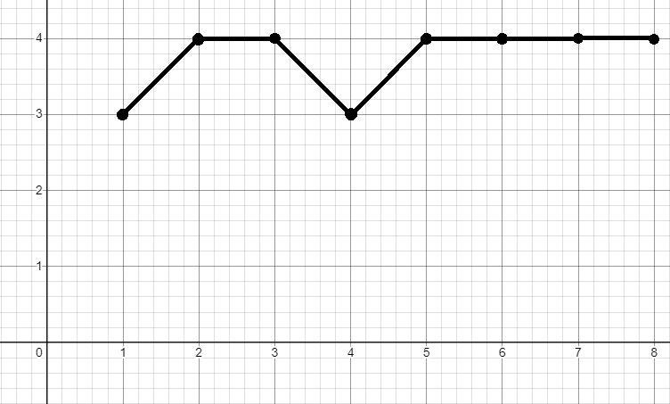

# АНАЛИЗ ДАННЫХ И ИСКУССТВЕННЫЙ ИНТЕЛЛЕКТ [in GameDev]
Отчет по лабораторной работе #4 выполнил(а):
- Опарин Роман Дмитриевич
- РИ230935
Отметка о выполнении заданий (заполняется студентом):

| Задание | Выполнение | Баллы |
| ------ | ------ | ------ |
| Задание 1 | * | 60 |
| Задание 2 | * | 20 |
| Задание 3 | # | 20 |

знак "*" - задание выполнено; знак "#" - задание не выполнено;

Работу проверили:
- к.т.н., доцент Денисов Д.В.
- к.э.н., доцент Панов М.А.
- ст. преп., Фадеев В.О.

## Цель работы
Изучить перцептпрон

## Задание 1
### в проекте Unity реализовать перцептрон, который умеет производить вычисления: OR, AND, NAND, XOR
Обучение перцептпрона проходила на 8 эпохах, что позволило чаще перцептпрону заканчивать обучение без ошибок. 
- OR

Перцептрон успешно прошёл тренировку и правильно подставил значения в поля OR без ошибок.
- AND
 Перцептрон успешно прошел тренировку и правильно подставил значения в поля AND без ошибок.
- NAND

Перцептрон успешно прошел тренировку и правильно подставил значения в поля AND без ошибок.
- XOR

Перцептрон не смог научиться и правильно подставить значения в XOR. 
Увы Перцептпрон может решать только линейные задачи, когда же для описания XOR нужно две прямые, что и вызывает проблемы обучения
## Задание 2
### Построить графики зависимости количества эпох от ошибки обучения. Указать от чего зависит необходимое количество эпох обучения.
- Ось абсцисс - номера эпох
- Ось ординат - кол-во ошибок

- OR

- AND

- NAND

- XOR

Использование большего количества эпох зависит от качества обучения перцептрона.
Чем больше их тем более качественно он и с большей вероятностью без ошибочно вставлять значения. Ближе к 8 эпохе перцептрон научился и количество ошибкок уменьшается стремясь к нулю.
## Задание 3

## Выводы

В ходе лабораторной работы я выяснил как устроены перцептроны и каким образом они работают.

| Plugin | README |
| ------ | ------ |
| Dropbox | [plugins/dropbox/README.md][PlDb] |
| GitHub | [plugins/github/README.md][PlGh] |
| Google Drive | [plugins/googledrive/README.md][PlGd] |
| OneDrive | [plugins/onedrive/README.md][PlOd] |
| Medium | [plugins/medium/README.md][PlMe] |
| Google Analytics | [plugins/googleanalytics/README.md][PlGa] |

## Powered by

**BigDigital Team: Denisov | Fadeev | Panov**
